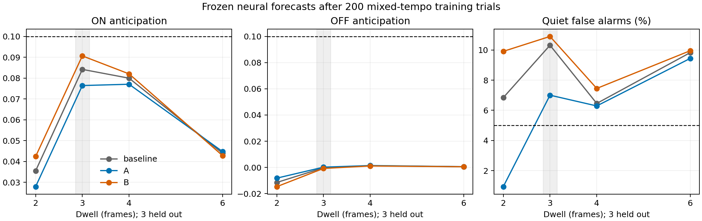

# Adaptation-dependent expression does not solve mixed-tempo prediction

Both approved candidates fail at every evaluated tempo. Candidate A reduces
quiet false alarms, especially at the fastest tempo, but does not recover useful
OFF anticipation. Candidate B slightly improves some ON forecasts while generally
increasing quiet errors. Neither qualifies for confirmation. Stop this family
without additional training or parameter tuning. M1A remains unmet; M1B is blocked.

This rejects the two specified couplings, not every possible use of adaptation.
The earlier audit showed that local context differs; this experiment shows that
these simple complementary gains and matching local credit do not exploit it
well enough to learn the required forecast.

## Fixed experiment and verification

The [approved proposal](../plans/2026-09-21-adaptation-context-proposal.md) defines
u=a/(theta+a), with A using g_E=2(1-u), g_I=2u and B reversing them. Only visual
forecast expression and captured issue-time credit change. Physical dynamics at
identical frozen weights remain bit-exact. No new state, edges, sign changes,
backpropagation or learned readout is introduced.

Each candidate starts from the same original crop and trains for 200 trials on
the exact previous mixed schedule, seed 9060: 67/67/66 trials at dwells 2/4/6.
Each run contains 11,158 camera frames and 89,264 neural ticks. Frozen evaluation
uses 15 trials per tempo at 2/3/4/6 with matched blanks, seed 9073; tempo 3 is
unseen in training. Each condition has 45 scored ON and 45 OFF events. Initial,
trained, zero and persistence comparisons use the existing +8-tick horizon,
first-cycle exclusion and remaining quiet samples.

Targets match across all conditions; evaluation weights are unchanged. States
remain finite and magnitudes bounded in training and evaluation. Unit-gain
learning reproduces baseline predictions, targets, spikes, eligibility, updates
and final weights bit-for-bit on the real crop. Independent signed-current
reconstruction and issue-time gain tests pass for both orientations.

The expression is evaluated as baseline P+(g_E-1)E+(g_I-1)I. This is algebraically
g_E E+g_I I, while preserving the baseline accumulation exactly at unit gains;
direct re-summing had introduced a 2.98e-8 identity-control discrepancy.

## Frozen trained forecasts

Anticipation is mean(target sign times forecast), requiring at least 0.1 for
each polarity. Quiet false alarms must be at most 5%. All rows also fail the
complete existing error-reduction criteria; no threshold was relaxed.

| Dwell | Model | MSE | ON anticipation | OFF anticipation | Quiet false alarms |
|---|---|---:|---:|---:|---:|
| 2 | Baseline | 0.172479 | 0.035457 | -0.011507 | 6.84% |
| 2 | A | 0.172706 | 0.027884 | -0.008207 | 0.94% |
| 2 | B | 0.172467 | 0.042351 | -0.014706 | 9.91% |
| 3, held out | Baseline | 0.138437 | 0.084186 | -0.000282 | 10.31% |
| 3, held out | A | 0.139262 | 0.076426 | 0.000190 | 7.00% |
| 3, held out | B | 0.137843 | 0.090660 | -0.000787 | 10.89% |
| 4 | Baseline | 0.121198 | 0.079959 | 0.001274 | 6.46% |
| 4 | A | 0.121455 | 0.077049 | 0.001416 | 6.29% |
| 4 | B | 0.121073 | 0.082020 | 0.001097 | 7.45% |
| 6 | Baseline | 0.100497 | 0.043922 | 0.000547 | 9.82% |
| 6 | A | 0.100540 | 0.044749 | 0.000558 | 9.44% |
| 6 | B | 0.100498 | 0.042808 | 0.000510 | 9.95% |

At tempo 2, all three trained models get 0/45 OFF signs correct. At held-out
tempo 3, baseline/A/B get 20/21/9 OFF signs correct out of 45. All get 45/45 ON
signs correct there. At tempos 4 and 6 all signs are correct, but OFF forecasts
are extremely weak. Correct sign therefore still does not mean effective
prediction. A's quiet improvement at tempo 2 accompanies weaker ON forecasts;
it is not a successful timing mechanism.

B's held-out MSE is only 0.43% lower than trained baseline, while OFF polarity
and quiet errors worsen. A's held-out MSE is 0.60% worse. Relative to their own
initial forecasts, A/B held-out MSE improves from 0.145212/0.144178 to
0.139262/0.137843, well short of the required 20% reduction. The rule can change
forecasts, but these results do not establish useful two-polarity prediction.

The main excitatory L2 -> L3 magnitude remains near the weak mixed baseline:
baseline 0.012119, A 0.012181, B 0.011666. The inhibitory L1 -> L3 magnitude is
0.110733/0.112747/0.107630 respectively. Both candidates retain the earlier
classwise update directions: ON confirmations decrease L2 magnitude while OFF
and quiet confirmations increase it; L1 has the opposite pattern. Thus this
coupling has not materially restored the suppressed excitatory pathway. These
update sums describe the runs, not a proof of irreducible learning conflict.



The dashed lines show required anticipation and quiet-error thresholds. The
shaded tempo was excluded from training. These are actual neural forecasts,
not an offline classifier. One training schedule, one evaluation batch and a
two-position motif do not establish general visual ability or its impossibility.

## Runtime and memory

Training A/B took 322.18/323.04 seconds while executing concurrently (about
34.6 frames/s each). Those times include final artifact compression and are
not an exclusive overhead comparison against earlier baseline runs.

A separate exclusive benchmark exercises learning observation, capture and
synchronization with all three update rates set to zero, preserving identical
weights and spike activity. Three rotated-order 37-frame runs, excluding warmup,
give median baseline/A/B times 1.0928/1.2080/1.1291 seconds: approximately
10.55%/3.33% overhead. This short, diagnostic-heavy benchmark is noisy and does
not measure throughput of the optimized full-connectome training path.

Direct persistent network tensors occupy 84,318 bytes in all three variants.
Separate four-frame blank-sequence CPU tensor profiles all peak at 14,917,494
bytes. This short peak is dominated by common work and does not demonstrate
zero temporary overhead. It excludes Python/NumPy/process memory and is not a
full-training memory peak. The third repeated timeline export crashed inside
the installed PyTorch C extension; an isolated-process export completed.
Profiling is now separate from timing/training and does not alter the model.

## Decision and reproduction

No candidate qualifies, so the prescribed fresh confirmation runs were not
started. Preserve the uncoupled area-matched model as reference. The next
[short-term synaptic-context proposal](../plans/2026-09-21-short-term-synaptic-context-proposal.md)
tests bounded depression/facilitation on existing predictive edges. It is not
approved or implemented. It changes physical transmission and therefore needs
the user's architecture approval. Its first check addresses whether autonomous
activity saturates the proposed state before spending training compute.

Reproduce with the existing data artifacts and environment:

```
.venv/Scripts/python scripts/adaptation_experiment.py preflight
.venv/Scripts/python scripts/adaptation_experiment.py benchmark
.venv/Scripts/python scripts/adaptation_experiment.py memory-baseline
.venv/Scripts/python scripts/adaptation_experiment.py memory-A
.venv/Scripts/python scripts/adaptation_experiment.py memory-B
.venv/Scripts/python scripts/adaptation_experiment.py train-A
.venv/Scripts/python scripts/adaptation_experiment.py train-B
.venv/Scripts/python scripts/adaptation_experiment.py evaluate
```

Run memory stages in separate processes. Preflight refuses an existing output
directory; training refuses existing artifacts; evaluation resumes completed
conditions. Raw artifacts are in ignored runs/adaptation-context-v1. The full
test suite passed with 243 tests and four skips; the eight focused regression
tests also passed after integration. Independent code review found no correctness
blockers and prompted the additional learning-path/memory benchmark.

[All initial/trained/zero/persistence metrics](2026-09-21-adaptation-context-results.json),
[selection](2026-09-21-adaptation-context-selection.json),
[training](2026-09-21-adaptation-context-training.json),
[verification and benchmarks](2026-09-21-adaptation-context-verification.json),
[incoming target weights/update sums](2026-09-21-adaptation-context-target-weights.json),
[artifact checksums](2026-09-21-adaptation-context-artifacts.json).
