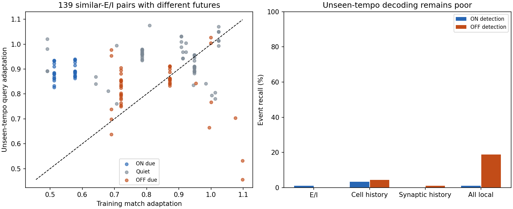

# Existing context differs, but reliable future decoding is not demonstrated

The result is **not a clean information-absence finding**. Existing adaptation
distinguishes every inspected cross-tempo pair with near-identical E/I and a
different future. However, the fixed local-state probes do not learn a reliable
mapping to that future, particularly at the unseen tempo. Pairwise difference
is not proof of a general predictive mechanism, and failed nearest-neighbor
decoding is not proof that information is absent.

No neural weights, dynamics, topology, signs or learning rule changed. No gate,
interval trace or other temporal state was added. M1A remains unmet.

## Setup

Freeze the mixed-tempo model from the previous experiment. Collect30 trials at
each dwell2/3/4/6 with matched blanks seed9070. At each forecast issue tick,
record the same existing local states before the +8tick target arrives. Fit
on trials1-15 of2/4/6, calibrate16-20, and test21-30. All30 trials at dwell3
remain held out. Each known-tempo test has30 ON and30 OFF events; unseen3 has
90 of each. Trial, tempo, phase and future labels never enter probe features.

Four fixed15-neighbor probes use training-only scaling. Calibration enforces
the quiet-error cap separately at each known tempo. Synaptic features are local
to incoming edges, not automatically a vector that one biological compartment
can read. A zero-learning observer exposes existing eligibility/activity traces;
it starts fresh after standard neural warmup and does not alter network state.

## Decoding fails to generalize reliably

Unseen three-frame tempo:

| Available features | ON event detection | OFF event detection | Quiet false positives | Event AUC |
|---|---:|---:|---:|---:|
| E/I only | 1/90 (1.1%) | 0/90 | 9.90% | 0.4319 |
| E/I + membrane/adaptation/own activity | 3/90 (3.3%) | 4/90 (4.4%) | 3.84% | 0.5945 |
| E/I + incoming synaptic history | 0/90 | 1/90 (1.1%) | 9.10% | 0.4037 |
| All recorded local state | 1/90 (1.1%) | 17/90 (18.9%) | 4.37% | 0.6400 |

Known-tempo test recall also falls short. E/I-only ON/OFF detection is43.3/76.7%,
43.3/70.0%,56.7/63.3% at2/4/6. All-local detection is56.7/53.3%,66.7/0%,66.7/0%.
These are event-versus-quiet recalls; signed confusion matrices are retained
separately. Detected events in these clean tests have the correct polarity, but
many events are missed. The larger feature set doing worse does not mean adding
information removes information: scaling, redundant dimensions and the fixed
distance metric can make a nearest-neighbor probe less effective.

The1%-training-SD perturbation barely changes the poor unseen-tempo result.
The shuffled all-local control detects no ON/OFF events and has unseen AUC0.6552,
versus0.6400 unshuffled. Thus AUC alone does not establish useful generalization
here. A single label shuffle is not a calibrated null distribution.

## Direct same-E/I, different-future matches

Each test sample is matched to the nearest training E/I sample from another
tempo without looking at either future label. Close means RMS distance no more
than0.01 after scaling E and I by pooled training SD. Future-label disagreements
are inspected only after matching.

| Test tempo | Close E/I matches | Different-future matches | Of these, events due in test |
|---|---:|---:|---:|
| 2 | 227 | 32 | 24 |
| 3, unseen | 893 | 139 | 79 |
| 4 | 271 | 43 | 22 |
| 6 | 380 | 61 | 32 |

The all-local probe correctly labels74/139 conflicting unseen-tempo queries,
versus25/139 for E/I alone. This improvement is insufficient:60 of the139 true
outcomes are quiet, so aggregate correctness must not be mistaken for strong
event detection.

A post-result direct comparison found that **adaptation differs by more than
1% of its training SD in every one of the275 conflicting pairs**, including
all139 at the unseen tempo and all79 unseen-tempo due-event pairs. It is an
already implemented postsynaptic state, not an invented clock.

Representative unseen-tempo ON-versus-quiet pair:

| Forecast-time quantity | ON due at unseen tempo3 | Quiet at training tempo2 |
|---|---:|---:|
| Excitatory current | 0.00590768 | 0.00590429 |
| Signed inhibitory current | -0.11567842 | -0.11574227 |
| Membrane voltage | 0.29449 | -0.24477 |
| Adaptation | 0.93523 | 0.51263 |

E/I RMS distance is only0.00148 training SD, while adaptation differs by2.26 SD.
An OFF-versus-quiet example has E/I distance0.00256 SD and adaptation0.97722
versus0.69017 (1.53 SD apart). Existing state therefore distinguishes these
specific examples comfortably; they are not identical full-state inputs with
contradictory labels.

An additional nearest-full-state audit requires EVERY nonconstant feature to
match within a tolerance (maximum-coordinate distance, not dimension-diluted
RMS). At1% training SD there are21 close cross-tempo pairs, all with the same
future. At5% there are74, again with no future disagreement. This is weak as
evidence of sufficiency because full-space matches are rare. It does not prove
that a usable, smooth or locally learnable mapping exists. Rate/adaptation can
also vary with tempo, cumulative activity or nuisance history without encoding
the right next-event relation.

The left panel plots existing adaptation for139 E/I-conflicting unseen-tempo
pairs. The diagonal denotes equal adaptation; points differ despite closely
matched currents. The right panel shows that such differences do not translate
into successful held-out-tempo decoding with the fixed probes.

## Mechanism options and decision

Adding memory merely because the probe failed would be premature. Existing
adaptation is the least costly context to examine first. The next architecture
discussion should specify how current local context influences prediction or
eligibility, rather than insert hand-fitted task thresholds. Any change to that
coupling or the learning rule needs an explicit bounded design and user approval;
none was implemented here. Success must be actual neural prediction on mixed
and held-out tempos, including quiet errors, not an offline classifier score.

If additional state is later justified, these options differ materially:

| Option | Locality and likely software cost | Main unresolved issue |
|---|---|---|
| Reuse existing adaptation in prediction/plasticity | Existing per-neuron state; a coupling could act only on participating synapses | Useful general relation to future events is unproven; could encode nuisance history |
| Short-term facilitation/depression on existing synapses | One or two extra variables per participating edge; exponential recovery can be updated at arrivals | Changes transmission/dynamics; requires cell-class justification, bounds and matched local eligibility |
| Local elapsed/interval traces | Small per-neuron or per-synapse state, decayed/sampled from actual local events | Choosing meaningful local events; risks becoming a two-position period detector instead of spatial prediction |
| Richer recurrent temporal dynamics on existing anatomical paths | Uses measured topology but may increase spikes and active-state work | Larger calibration/interpretability cost; cannot invent connections to make it work |

The cost statements are implementation estimates, not benchmarks. None should
use a tempo label, frame phase, trial reset, future event or externally supplied
clock phase. Any dynamic multiplier must preserve transmitter signs; topology
and no-backprop/local-learning constraints remain mandatory.

Short-term synaptic dynamics have relevant biological/model precedent: paired
neocortical recordings and modeling link depression/release probability to
temporal signaling ([Tsodyks and Markram,1997](https://pubmed.ncbi.nlm.nih.gov/9012851/));
a temporal-decoding model uses short-term synaptic plasticity to make responses
depend on stimulus history ([Buonomano,2000](https://pubmed.ncbi.nlm.nih.gov/10648718/)).
These support a candidate direction, not validation of parameters, mechanisms,
local learning success, or general vision in this fly crop. New state is not
yet established as necessary by the present audit.

## Verification and artifacts

Run `.venv/Scripts/python scripts/context_audit.py` with existing optional data
dependencies and mixed-training artifact. The run refuses to overwrite its
directory. All four collections retain90 ON and90 OFF targets, finite states
and unchanged weights. Tests cover signed-vote decoding and per-tempo calibration
caps. Full suite:235 passed,4 skipped. No production neural code changed.

[Protocol](2026-09-21-context-audit-protocol.md),
[probe results and matching counts](2026-09-21-context-audit-results.json),
[post-result full-state proximity](2026-09-21-context-audit-proximity.json),
[post-result adaptation comparisons](2026-09-21-context-audit-pairs.json).
Results contain raw-array and mixed-training checksums. Raw local state is in
ignored `runs/context-audit-v1`. The post-result comparisons are descriptive
recomputations from these arrays using training SD and cross-tempo nearest
neighbors; they did not refit or select a decoder.
