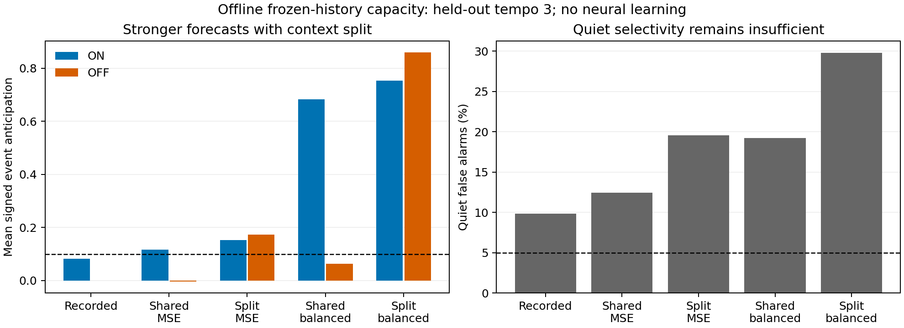

# Frozen-history capacity: polarity splitting strengthens events but cannot meet the quiet limit

Follow-up: [preserving event-balanced amplitude with temporal selection](2026-09-21-prediction-timing-findings.md). Tempo-specific diagnostic windows preserve amplitude; a shared window does not generalize.

**Polarity-specific magnitudes alone are insufficient on the recorded frozen histories.** They can express much stronger ON and OFF forecasts, but cannot simultaneously satisfy the existing anticipation and quiet-alarm requirements. Corrected feasibility checks report no solution even when each training tempo gets its own context-split coefficients. Removing the quiet constraint produces a verified feasible control.

This is a result about the specified frozen eligibility basis and coefficient bounds, not a proof that the recurrent connectome lacks capacity. No neural training, model rule change, checkpoint mutation or artificial prediction head was introduced. M1A remains unmet.

## What the capacity probe permits

The saved baseline context audit provides the local signed eligibility traces for all12 existing predictive edges into L3 body82450. Three columns have nonzero activity; nine are inactive on these histories. Multiplying by the original recorded magnitudes reconstructs the issued prediction within2.3e-8 after trial0. Trial0 is excluded at each tempo because the observer did not inherit the neural warmup's trace history. This is a source-reconstruction correction, not an outcome-based exclusion.

Shared fits use one nonnegative magnitude per existing edge. Split fits use two, selected by the forecast-time postsynaptic sensory state (>0 versus <=0). The shared model is nested inside the split model by choosing equal magnitudes for both contexts. There is no fitted bias, new edge, sign reversal, future input, tempo label or explicit phase input. The existing upper magnitude bound is10.

Only trials1-14 at dwells2/4/6 are fitted. Trials15-19 remain unused. Tests use trials20-29 at known tempos and all29 remaining trials of unseen tempo3 (87ON and87OFF samples there). Quiet samples remain in the data. The two fixed objectives are ordinary frame-weighted squared error and equal total weight for ON/OFF/quiet categories. Fits minimize raw linear error; reported forecasts use the existing [-1,1] clipping. These global offline fits are deliberately more permissive than local online learning and are never installed in the model.

## Held-out tempo3 results

| Diagnostic | MSE | ON anticipation | OFF anticipation | Quiet alarms |
|---|---:|---:|---:|---:|
| Recorded baseline | 0.128412 | 0.082489 | -0.000280 | 9.84% |
| Shared, frame MSE | 0.126067 | 0.115687 | -0.003787 | 12.42% |
| Split, frame MSE | 0.104361 | 0.151958 | 0.172751 | 19.60% |
| Shared, event-balanced | 0.152899 | 0.682248 | 0.063152 | 19.23% |
| Split, event-balanced | 0.157200 | 0.752320 | 0.860138 | 29.81% |

Required anticipation is at least0.1 for each polarity; quiet alarms must be at most5%. No fit passes those three conditions together. The frame-MSE split reaches both anticipation thresholds but has19.60% quiet alarms. Its MSE improves18.73% over the recorded baseline, which is not by itself a learning result or an M1A pass. Event balancing can produce very strong forecasts, but further increases quiet error. Both balanced fits clip some predictions; their raw least-squares objectives should not be mistaken for global optima of clipped MSE.



## Direct feasibility separates objective choice from coefficient capacity

Least squares alone cannot establish that every coefficient choice fails a threshold-based criterion. A second diagnostic therefore searches directly for coefficients satisfying, separately at each fitting tempo:

- Mean clipped signed ON anticipation >=0.1.
- Mean clipped signed OFF anticipation >=0.1.
- No more than floor(5% of quiet samples) unconstrained quiet outputs.

All other quiet outputs may have raw magnitude up to0.100001. This is slightly **more permissive** than the actual alarm at magnitude>=0.1; infeasibility of this relaxation also excludes the stricter alarm requirement, subject to numerical solver accuracy. Event clipping is represented explicitly, including the negative saturation branch. No overall or per-polarity MSE-improvement requirements are imposed, so these constraints are weaker than the full acceptance gate.

| Permitted coefficients | Fitting data | Corrected solver result |
|---|---|---|
| Shared magnitudes | Training tempos2/4/6 together | Infeasible |
| Polarity-split magnitudes | Training tempos2/4/6 together | Infeasible |
| Polarity-split magnitudes, tempo-specific | Training tempo2 only | Infeasible |
| Polarity-split magnitudes, tempo-specific | Training tempo4 only | Infeasible |
| Polarity-split magnitudes, tempo-specific | Training tempo6 only | Infeasible |
| Polarity-split magnitudes, no quiet cap | Training tempos2/4/6 together | Feasible control |

Each solve had a15-second limit; all returned a resolved status, not a timeout. The feasible control's maximum constructed-constraint violation is8.9e-16, and independently scored event means meet the requirement. Its training quiet alarms are39.9%,44.0%,53.8% at2/4/6 respectively. This control is a feasibility witness, not an optimized low-alarm model. No held-out tempo labels were used in any fit or feasibility search.

The within-tempo failures matter: the obstruction is not merely asking the same weights to accommodate multiple speeds. With these fixed traces and this polarity-only selector, event amplitude and surrounding quiet cannot both satisfy the required criteria even at a single tested speed.

## A solver failure was caught and corrected

The installed solver's presolve initially reported infeasibility even for the no-quiet control, despite a known coefficient vector from the balanced fit satisfying every constructed constraint exactly. That invalidated the initial feasibility outputs. They were discarded from the scientific conclusion.

The actual multiscale feature matrix and known weights are preserved as a small regression fixture. The test failed with presolve enabled and passed after disabling it. All final feasibility results were rerun with presolve disabled; the no-quiet control now resolves correctly. Synthetic tests also cover bounded fitting, nested contexts, zero-forecast scoring, clipping, feasible/infeasible examples and the lower clipping branch. Final relevant suite: **45 passed**. Published artifacts/checksums were verified and the plot inspected.

## Implication for the next architecture discussion

There is evidence that separating polarity credit can help event amplitude, but it is not enough to justify a polarity-only two-magnitude implementation. I recommend stopping that narrow direction here rather than spending another long training run on it.

The next proposal should address how local temporal context changes the **time course of the expressed prediction**, with credit attached to the same forecast-time context. It must preserve useful sign memory while distinguishing a due event from the quiet interval around it. Merely routing updates into two polarity buckets leaves the demonstrated within-context timing problem.

This does not establish that a new clock or temporal state is required. Existing membrane/adaptation/synaptic history may support a different expression mechanism; the previous state probes did not exhaust that possibility. Likewise, physically changing weights could change upstream spikes, activate currently silent edges, and produce histories outside this frozen basis. The result is specifically against solving the recorded failures solely by reweighting these existing traces with a two-way polarity selector.

A biological local mechanism, its forecast expression, and its matching credit rule need an explicit proposal before implementation. No architecture revision or new neural experiment is included here.

## Artifacts and reproduction

- [Protocol, exploratory feasibility extension and correction](2026-09-21-credit-capacity-protocol.md)
- [Complete fit coefficients, per-tempo metrics, corrected feasibility results and provenance](2026-09-21-credit-capacity-results.json)
- [Preceding live-credit investigation](2026-09-21-credit-replay-findings.md)

```powershell
.venv/Scripts/python scripts/credit_capacity.py
.venv/Scripts/python scripts/credit_feasibility.py
.venv/Scripts/python scripts/credit_capacity_report.py
.venv/Scripts/python -m pytest tests/test_credit_capacity.py tests/test_credit_feasibility.py tests/test_credit_replay.py tests/test_frame_prediction.py tests/test_short_term.py tests/test_context_audit.py tests/test_short_term_comparison.py -q
```

Raw frozen-feature predictions and diagnostic coefficients are saved under `runs/credit-capacity-v1`. Checkpoints and production code remain unchanged. No backpropagation or surrogate-gradient computation was used.
