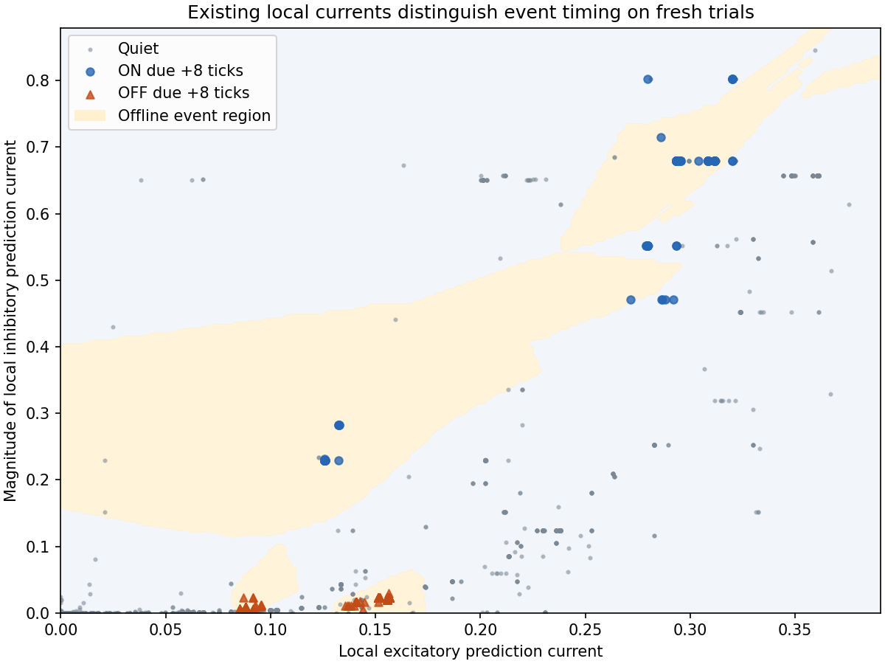

# Existing local currents contain useful event timing information

For this controlled repeated trajectory, the diagnostic supports **designing a
local timing gate**, rather than adding a new temporal cue as the next step.
Even the existing prediction currents distinguish an event due at +8 ticks from
nearby quiet frames with high held-out detection rates. This does not demonstrate
a biologically realizable gate or that the existing local rule can learn one.
No gate or architecture change was implemented; M1A remains unmet.

## What was tested

Freeze the successful area-matched model's learned weights and dynamics. At each
forecast issue tick, record only target-local current, membrane/adaptation/spike
state and incoming synaptic traces. The label concerns an event eight ticks later.
Future input, trial index, phase and timestamps are excluded from features.
Full frozen neural predictions, targets and spike arrays exactly reproduce the
previous evaluation. A zero-learning shadow observer exposes the existing local
eligibility/post-spike/rate machinery without changing neural state or weights.

The fixed offline detector uses 15 nearest training neighbors after training-only
standardization. Fit seed9023 trials1-25, calibrate the event threshold on26-35,
and test on36-50. Then confirm without retuning on50 fresh trials (seed9024).
The fresh set changes blank intervals, not direction, speed or trajectory shape.
All original scored quiet frames and cue exclusions remain unchanged. See the
[protocol](2026-09-21-local-information-protocol.md).

## Held-out distinguishability

The current-only input is total predictive current plus its excitatory and
inhibitory components. There are only two independent quantities: the total is
their sum. These are existing cell-level states, not remote information.

| Probe and evaluation | ON detection | OFF detection | Quiet false positives | AUC |
|---|---:|---:|---:|---:|
| Currents only, held-out15 trials | 44/45 (97.8%) | 45/45 (100%) | 24/572 (4.20%) | 0.9970 |
| Currents only, fresh50 trials | 144/150 (96.0%) | 146/150 (97.3%) | 82/1922 (4.27%) | 0.9931 |
| Synaptic state plus currents, fresh | 145/150 (96.7%) | 150/150 (100%) | 72/1922 (3.75%) | 0.9959 |
| All cell-level state, fresh | 121/150 (80.7%) | 147/150 (98.0%) | 50/1922 (2.60%) | 0.9899 |
| All local state, fresh | 135/150 (90.0%) | 149/150 (99.3%) | 71/1922 (3.69%) | 0.9899 |

Detection means event-versus-quiet recall, reported separately on true ON and OFF
events; the diagnostic does not classify polarity. Precision of the current-only
detector is77.96%, reflecting remaining false positives among many quiet frames.
Larger feature sets do not necessarily help this fixed nearest-neighbor metric;
their lower recall is not evidence that adding those states removes information.
No hyperparameter or feature-selection search was performed.

## The nearby quiet frames are distinguishable too

Current-only fresh-set false positives by phase:

| Quiet phase | False positives |
|---|---:|
| First camera frame after ON | 2/150 (1.33%) |
| Second frame after ON, before OFF | 4/150 (2.67%) |
| First frame after OFF | 0/150 |
| Second frame after OFF, before ON | 0/150 |
| Intertrial/initial blank frames | 76/1322 (5.75%) |

Only6 of600 near-event quiet frames are confused with due events. The result
is not merely recognition of motion versus long blank periods. The synaptic
probe has0/600 near-event false positives, with its72 errors in blank periods.
Some residual ambiguity remains, especially in blank transients.

Points show fresh held-out states; yellow shading is the offline detector's
event region fitted/calibrated on earlier trials. It is not a biological gate
or a claim about unobserved parts of the state plane. ON and OFF due states
occupy different regions of the existing excitation/inhibition state plane;
the separate components make that structure more accessible to this probe.

A post-result scalar ablation used only the summed signed current, with the same
15-neighbor method and original training/calibration split. Fresh detection fell
to75.3% ON /89.3% OFF at3.49% quiet false positives (AUC0.9797); it confused
25/150 quiet frames immediately before OFF, versus4/150 with separate components.
This supports retaining excitation/inhibition balance in a timing mechanism.
It does not prove that the scalar contains no usable timing information or that
every scalar-based mechanism would fail. This supplemental comparison was not
part of the predeclared four-group analysis.

## Robustness and limits

Adding independent noise with standard deviation1% of each training feature's
standard deviation leaves current-only fresh detection at96.0% ON /98.0% OFF,
with4.32% quiet false positives and AUC0.9917. This is numerical sensitivity,
not a calibrated biological noise model. Shuffling training labels reduces the
all-local probe's fresh AUC to0.4592, ON recall10.7% and OFF recall0% at its
calibrated threshold, arguing against a trivial evaluation artifact.

A fixed-probe bootstrap resampling whole fresh trials2000 times gives95%
intervals: ON recall91.3-99.3%, OFF94.7-99.3%, quiet false positives3.49-5.20%.
The upper false-positive bound exceeds5%, so this is positive information
evidence, not a statistical guarantee of passing that gate on future data.

The task is still the same deterministic periodic motion with randomized blanks.
The experiment does not establish generalization to different velocities,
directions, interruptions or arbitrary Pong trajectories. Incoming synaptic
features are distributed local information; a future mechanism would have to
respect that locality. The current-only result is stronger for immediate design
purposes because it does not require accessing a vector of private synaptic states.

## Decision

The next step should be a **local nonlinear timing/expression mechanism using
the existing excitatory and inhibitory memory states**, preserving the signed
prediction. There is no current evidence that this task requires another temporal
cue. The offline nearest-neighbor classifier must not be inserted as a learned
readout or mistaken for local-plasticity success. A concrete gate must still be
specified, learned/implemented within the project constraints, and evaluated
against all existing ON/OFF/quiet criteria. No further mechanism was invented
or tested in this diagnostic.

## Verification and reproduction

Run `scripts/local_information.py` using the project environment with its existing
`data` extra (SciPy). The run took33.20s. New tests cover training-only feature
scaling, constant features and calibration/quiet accounting. Full suite225passed,
4CUDA skips. Independent review found no leakage/locality blocker. Neural weights,
source checkpoint, dynamics, topology and signs remain unchanged; no neural
training/backpropagation or production changes occurred.

[Full results](2026-09-21-local-information-results.json),
[supplemental scalar ablation](2026-09-21-local-information-scalar-ablation.json),
[trial bootstrap](2026-09-21-local-information-bootstrap.json), and
[local feature-artifact hashes](2026-09-21-local-information-artifacts.json).
