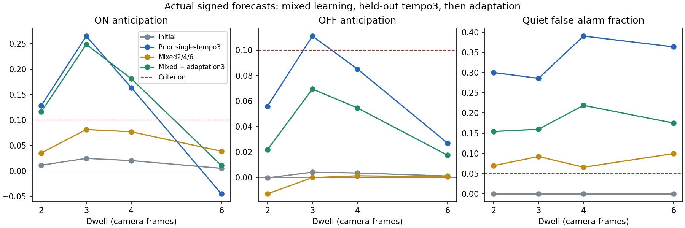

# Mixed-tempo local learning suppresses the OFF pathway

Training the unchanged model on multiple tempos does not by itself produce
useful two-polarity prediction. After200 interleaved trials at dwells2,4,6,
all trained tempos and held-out dwell3 fail the fixed controlled-task criteria.
The result concerns actual signed neural forecasts; no E/I threshold gate or
offline classifier is used to generate or score the predictions.

## Experiment and controls

The [protocol](2026-09-21-multitempo-protocol.md) fixes the architecture, initial
checkpoint, area-matched20ms excitatory/5ms inhibitory currents, frame-horizon
local learning, eight ticks/frame and next-frame forecast. Topology, signs and
no-backprop requirements are unchanged. Mixed training interleaves67/67/66
trials at dwells2/4/6. It contains11,158 camera frames and takes164.62s, about
67.8 camera frames/s. States stay finite, weights within bounds;175 weights change.

Frozen evaluation uses15 trials per tempo with matched blanks, standard warmup,
continuous state within each condition, and first-cycle cue exclusion. Each
condition has45 scored ON and45 scored OFF events. Initial, previous single3,
mixed and adapted variants receive identical targets at each tempo; evaluation
weights are asserted unchanged. Dwells2/4/6 are trained tempos;3 is held out
from mixed training. No tempo/trial label enters the neural network.

Slower trials contain more quiet frames. Equal trial counts are not equal time
at each tempo. Previous single3 training is a reference with a different stimulus
distribution, not an equal-frame randomized causal comparison of curricula.

## Mixed training: frozen forecasts

Anticipation is mean(target sign * prediction); positive means correct direction,
negative means wrong direction. The criterion requires at least0.1 for both
polarities, alongside error reduction and quiet false alarms at most5%.

| Dwell | Initial ON / OFF anticipation | Mixed ON / OFF anticipation | Mixed quiet false alarms |
|---|---|---|---:|
| 2, trained | 0.01140 /-0.00028 | 0.03544 /-0.01279 | 6.98% |
| 3, held out | 0.02471 /0.00418 | 0.08145 /-0.00009 | 9.24% |
| 4, trained | 0.02043 /0.00356 | 0.07702 /0.00133 | 6.58% |
| 6, trained | 0.00527 /0.00117 | 0.03887 /0.00054 | 9.96% |

Mixed MSEs are0.15779,0.12842,0.11362,0.09569 at dwells2/3/4/6, versus initial
0.15823,0.13401,0.11841,0.09708. These small improvements do not meet the
required20% reduction, and all conditions fail both anticipation and quiet
criteria. Reported MSE includes quiet frames; small MSE alone is not success.

The previous single3 model on the same evaluation has ON/OFF anticipation
0.26485/0.11095 at dwell3 but28.60% quiet false alarms. At dwell6 its ON
anticipation is-0.04478. The mixed result therefore does not resolve the earlier
timing/specialization problem by merely adding training variety.

## The recorded local updates identify a conflict

At target L3 body82450, the main excitatory L2 body20655 magnitude moves from
0.025 initially to0.012119 after mixed training. Its single3 reference magnitude
is0.604755. The inhibitory L1 body26550 magnitude moves from0.045 to0.110733,
versus0.650577 in the single3 reference.

Actual recorded sums of local magnitude updates across the mixed run:

| Incoming pathway | ON-confirmation updates | OFF-confirmation updates | Quiet-confirmation updates |
|---|---:|---:|---:|
| Excitatory L2 -> L3 | -2.08765 | +0.82444 | +1.01080 |
| Inhibitory L1 -> L3 | +2.30352 | -0.29282 | -1.94497 |

These are proposed local magnitude increments, not transmitter-sign changes.
Bounds can clip updates, so their sum need not equal final minus initial weight.
The excitatory pathway is driven down by ON examples while OFF and quiet
examples drive it up. The inhibitory pathway has the opposite conflict. In
particular, the quiet contribution to L2 is positive: saying the model simply
"learned no movement because quiet samples dominate" would misdescribe this run.

This directly establishes conflicting local update directions, not a proof that
every possible weight configuration or longer training must fail. The model
currently adjusts shared pathway magnitudes to satisfy different temporal
contexts; this run settles on weak OFF expression.

## Adaptation and retention

Starting from mixed weights,100 further trials at held-out dwell3 take73.95s
for4913 frames (66.4 frames/s). Neural state and local learning remain continuous
within that adaptation run; the run starts with standard warmup and a fresh
learning observer. This is adaptation after initialization from mixed weights,
not an uninterrupted continuation of the mixed-training neural state.

The excitatory L2 magnitude rises from0.012119 to0.391117; inhibitory L1 rises
from0.110733 to0.519809. Frozen forecasts on the identical evaluation sequences:

| Dwell | Mixed ON / OFF anticipation | Adapted ON / OFF anticipation | Mixed -> adapted quiet false alarms |
|---|---|---|---|
| 2 | 0.03544 /-0.01279 | 0.11636 /0.02177 | 6.98% ->15.43% |
| 3, adaptation tempo | 0.08145 /-0.00009 | 0.24850 /0.06941 | 9.24% ->15.99% |
| 4 | 0.07702 /0.00133 | 0.18119 /0.05461 | 6.58% ->21.90% |
| 6 | 0.03887 /0.00054 | 0.01092 /0.01750 | 9.96% ->17.53% |

At dwell3, all45 ON and45 OFF forecasts have correct sign after adaptation.
MSE improves from0.12842 to0.11239, a12.5% reduction relative to mixed weights.
This is real local-learning improvement, but OFF anticipation remains below0.1
and quiet errors exceed5%. No adapted condition passes the controlled-task gate.
Correct sign alone is insufficient, and positive mean anticipation can conceal
wrong-sign cases: at dwell2 only16/45 ON and31/45 OFF are correct after adaptation.

Adaptation improves event anticipation at neighboring dwell4 as well, so it is
not exclusively a single-tempo effect. However, at dwell6 MSE worsens from0.09569
to0.11448 (19.6%), ON anticipation weakens, and quiet errors rise. Thus the result
is retuning with incomplete transfer and retention, not a robust multi-tempo
solution. No additional training duration or hyperparameter was selected from
these results.



## What this establishes and the next decision

The rule is active and can improve actual signed forecasts through adaptation;
the experiment rules out treating the previous failure as mere inability to
update weights. But a200-trial mixed curriculum does not solve prediction across
tempos, and100-trial specialization does not meet timing/quiet criteria either.
The update audit describes what happened, not proof that conflicting classwise
gradients are inherently pathological: opposite updates can also occur in
successful learning.

Do not add a fixed E/I threshold gate, claim general visual prediction, or launch
a longer blind training sweep on this evidence. The next discriminating question
is whether similar local states receive incompatible next-event targets across
tempos, and whether existing membrane/adaptation/synaptic history distinguishes
those cases. A cross-tempo local-state audit on the mixed model can separate
insufficient temporal context from an expression/learning-rule limitation. It
must use held-out trials and tempo, with no tempo label supplied to the probe or
model. That evidence should precede any proposed architectural change.

This is one fixed training seed, one adaptation seed, and one evaluation batch;
it does not prove convergence failure, irreducible incapacity, or biological
generality. The task still uses the same two positions and appearance. Even
successful tempo generalization here would be only one prerequisite for broader
vision. M1A remains unmet; M1B should not begin.

## Verification and reproduction

Use the existing project environment and artifacts:

```
.venv/Scripts/python scripts/multitempo.py train
.venv/Scripts/python scripts/multitempo.py evaluate
.venv/Scripts/python scripts/multitempo.py adapt
.venv/Scripts/python scripts/multitempo.py evaluate-adapted
```

Each training stage saves its schedule before execution and its weights/traces
after completion. Evaluations save results after each model/tempo and can resume
completed entries. New schedule test checks balanced interleaving, held-out
tempo exclusion, frame lengths, event counts and reproducibility. Full suite:
233 passed,4 skipped. Production neural code is unchanged. The model remains
finite and within weight bounds throughout learning/evaluation. M1A remains unmet.

[All evaluation metrics](2026-09-21-multitempo-results.json),
[mixed training](2026-09-21-multitempo-training.json),
[adaptation training](2026-09-21-multitempo-adaptation.json),
[target weights and actual update sums](2026-09-21-multitempo-target-weights.json),
[artifact checksums](2026-09-21-multitempo-artifacts.json).
Raw predictions, targets, spikes, eligibility, schedules and weights are in
ignored `runs/multitempo-v1`.
