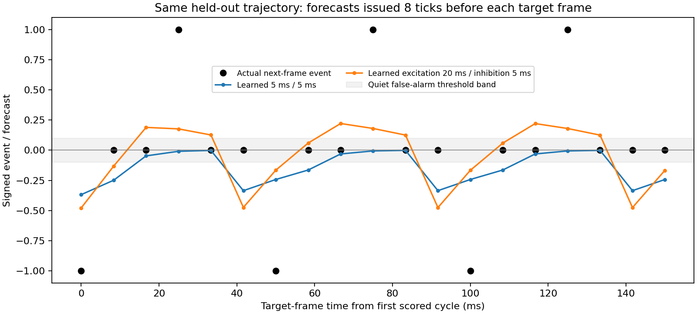

# OFF sign audit and slower excitatory predictive current

The narrow audit found no erroneous sign reversal in six selected OFF cases.
The authorized kinetics experiment then produced correct-sign anticipation for
all 150 ON and all 150 OFF evaluation events. It passes the existing error and
event-anticipation criteria, but fails the quiet false-alarm criterion. This is
progress toward two-polarity prediction, not a completed small-task gate or M1A.

## Tick-by-tick sign audit

Replay the first three recurring OFF cases of the first fixed precursor trial
using independent warmed initial and learned network copies, with actual online
frame-horizon updates. Source artifacts remain unchanged. Each case records the
preceding 24 ticks through eight ticks afterward. Spikes are unsigned booleans;
fixed source transmitter signs determine outgoing current polarity. Sensor
contrast explicitly encodes OFF as +1 and ON as -1.

For the first OFF case in the learned copy, the forecast is issued at tick 248
and confirmed at tick 256. The actual target at confirmation is +1:

| Source | Fixed sign | Retained eligibility at issue | Current contribution at issue | OFF magnitude-update proposal |
|---|---:|---:|---:|---:|
| L2 20655 | +1 | +0.0264961 | +0.0002106 | +0.000267296 |
| L1 26550 | -1 | -0.0264961 | -0.0090207 | -0.000267296 |

The net issue-time forecast is -0.0088101. The error is therefore positive.
Increasing the excitatory magnitude and decreasing the inhibitory magnitude
both move subsequent comparable predictions in the correct positive direction.
These are local proposals before weight bounds/homeostasis, not assertions of
instantaneous current changes. Existing current retains its weight-at-arrival
history; a weight update does not retroactively reweight that history.

Selected ticks (all intermediate ticks are preserved in the linked audit):

| Tick | Target now | L2 recurrent contribution | L1 recurrent contribution | Net current | L2/L1 proposal |
|---|---:|---:|---:|---:|---:|
| 232, preceding ON | -1 | +0.0059026 | -0.2528647 | -0.2469621 | -0.0069725 / +0.0069725 |
| 240 | 0 | +0.0011149 | -0.0477600 | -0.0466451 | +0.0018343 / -0.0018343 |
| 248, OFF forecast | 0 | +0.0002106 | -0.0090207 | -0.0088101 | +0.0000654 / -0.0000654 |
| 249 | 0 | +0.0001710 | -0.0073242 | -0.0071533 | 0 / 0 |
| 255 | 0 | +0.0000490 | -0.0020984 | -0.0020494 | 0 / 0 |
| 256, OFF arrives | +1 | +0.0000398 | -0.0017038 | -0.0016640 | +0.0002673 / -0.0002673 |

The update at tick 256 uses the forecast from tick 248, not the current at 256.
The earlier ON proposal is about 26 times the later OFF proposal in magnitude.
Both active sources have nearly identical spike-history traces with opposite
transmitter signs; these traces have largely decayed by OFF forecast time.
The observed issue is weak, poorly differentiated precursor features and their
unequal credit across phases, not an OFF update pushing in the wrong direction.
This conclusion is bounded to the inspected cases; it is not an exhaustive
proof about every neuron or stimulus.

[All tick/edge values as CSV](2026-09-21-off-sign-audit.csv) and
[full audit including source sensory/membrane state](2026-09-21-off-sign-audit.json).
Reproduce with `scripts/off_sign_audit.py` from the repository root after the
frame-horizon run. Current reconstruction agrees within 1e-6; local update
arithmetic agrees within float32 rounding.

## Authorized kinetics experiment

Change predictive excitatory decay from 5 ms to 20 ms and keep inhibitory decay
at 5 ms. The corresponding local eligibility uses the same signed-edge decay.
All eight neural ticks/frame, frame-horizon supervision, measured topology,
signs, delays, initial magnitudes, learning rate, other neuronal dynamics and
behavioral learning remain fixed. No backpropagation or added readout.
The [protocol](2026-09-21-signed-kinetics-protocol.md) specifies the opt-in model.

Same 200 training trials and 50 frozen evaluation trajectories as before:

| Metric | Previous learned 5/5 ms | New frozen initial 20/5 ms | New learned 20/5 ms |
|---|---:|---:|---:|
| Overall MSE | 0.121254 | 0.137102 | **0.107658** |
| ON-event MSE | 0.543302 | 1.003735 | **0.522855** |
| OFF-event MSE | 1.017638 | 0.961672 | **0.707032** |
| Signed ON anticipation | 0.270484 | -0.001856 | **0.290590** |
| Signed OFF anticipation | -0.008774 | 0.019366 | **0.159964** |
| Quiet false alarms | 16.30% | 0% | **37.08%** |

All 150 ON and 150 OFF evaluation events now have the correct forecast sign.
Compared with its own frozen initial state, the new model learns improvements
in both event polarities. Overall error is 21.48% below that baseline and 22.74%
below zero prediction. Each event error improves by more than 10%; both signed
anticipation means exceed 0.1. **Only the quiet false-alarm gate fails** (37.08%
versus maximum 5%). Do not remove quiet frames or relax that threshold.

The slower current also increases integrated excitatory drive because arrival
amplitudes remain fixed. The result therefore supports the combined kinetics
change, not an isolated causal claim that temporal shape alone fixes OFF. The
20 ms value is a diagnostic choice, not a measured physiological parameter.

## Is the learned OFF response stimulus-dependent?

Repeat the same 10 paired precursor/blank probes with frozen initial and learned
weights under the new dynamics. Thirty recurring events per polarity:

| Mean signed quantity | Initial | Learned |
|---|---:|---:|
| ON forecast | -0.004969 | +0.266109 |
| ON stimulus-minus-blank effect | +0.001695 | +0.258903 |
| OFF forecast | +0.020229 | +0.180225 |
| OFF stimulus-minus-blank effect | +0.019531 | +0.150228 |

The learned OFF forecast exceeds its blank response substantially. This is not
merely a positive tonic offset, and ON remains stimulus-dependent as well. The
remaining problem is broad predictions extending into quiet camera frames:

This single held-out trajectory illustrates the aggregate false-alarm result;
it is not used to select the parameter or score. Points compare forecasts issued
eight ticks earlier with the event at the target frame.

## Verification, limitations and next decision

The first attempted run stopped before training because the existing frozen
trace reconstruction omitted warmup spikes. Slower currents made that omission
measurable. Capture and prepend warmup history, then slice it off the output;
do not relax the tolerance or alter the simulation. A failing regression test
now covers this case. The successful run's maximum reconstruction error is
7.63e-9. Frozen precursor availability remains 30/30 in both polarities.

New tests cover exact impulse shapes, signed eligibility/current consistency,
unchanged default decay and warmup reconstruction. Full suite: 218 passed,
4 CUDA skips. Independent review found no remaining blocker. Main run 98.18 s;
additional frozen paired probes 14.20 s. States remain finite, weights bounded,
and source checkpoint/frozen evaluation weights unchanged. Training targets,
blank intervals and initial weights match the prior run exactly.

This is one seed and one cropped circuit, not an intact-connectome result.
Defaults remain unchanged. Extra signed-current state is supported only by the
experimental reference runner, not native kernels or production checkpointing.
M1A and M1B have not advanced.

Stop this bounded experiment with a positive two-polarity learning result and a
specific remaining failure: temporal selectivity on quiet frames. Any next
architecture proposal should preserve the now-demonstrated two-polarity gains
while reducing those false alarms, and should separate decay shape from impulse
area before attributing the gains solely to time constants. Do not add a long
training sweep or silently promote this experimental model.

[Full results](2026-09-21-signed-kinetics-results.json),
[paired probes](2026-09-21-signed-kinetics-precursor-comparison.json), and
[local artifact hashes](2026-09-21-signed-kinetics-artifacts.json).
