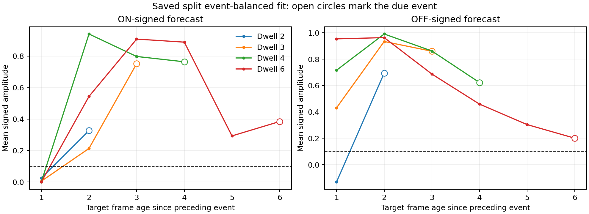

# Preserve event-balanced amplitude; calibrate temporal expression

**The strong event-balanced forecasts are worth preserving.** A tempo-specific window on an already existing local current retains 100% of their held-out ON/OFF amplitude while reducing quiet alarms below 5%. A single window across tempos fails, including at unseen tempo 3. This points toward locally adapting the expected temporal window rather than weakening the sign/amplitude pathway.

This is an offline diagnostic on saved histories, not an implemented gate or an online-learning result. Tempo-specific controls use external tempo to select a window; they are not valid neural mechanisms. Model topology, signs, dynamics, plasticity and checkpoints remain unchanged. M1A remains unmet.

## Preserve the reference

The coefficients of the earlier split event-balanced fit are copied verbatim into the results. Its frozen predictions and source hashes are preserved, with no amplitude refitting. At held-out tempo 3 its ON/OFF anticipation remains 0.752320/0.860138 before any suppression. The present work only examines that reference and applies diagnostic zero/one masks; retained samples keep their original amplitudes exactly.

## Quiet errors mostly include forecasts that are early

Predictions are plotted at their intended target frame, one camera frame ( +8 neural ticks) after issue. Thus the horizontal axis below is not a direct neural response latency. The open circle is the actual due event; preceding points are quiet frames.



At tempo 3, OFF-signed output is 0.431 and 0.934 at the first and second quiet frames after ON, then 0.860 when OFF is due. At tempo 6 it is already 0.954/0.963 in the first two quiet frames, then decays to 0.200 when OFF is due. The ON response also tends to become strong before the due event at slower tempos. This is not uniformly a stale same-polarity tail: much of the signal is already expressing the **next** polarity too soon. Some short-tempo phases have different signs; the complete phase breakdown is retained.

At held-out tempo 3, there are 324 quiet alarms: 193 during inter-event motion phases and 131 during blank frames. Blank frames account for 34.1% of quiet squared error; inter-event frames account for 65.9%. Blanks include stopped-motion carryover, not just an independent resting baseline. The first unannounced absence after motion stops cannot be predicted from an identical preceding history, as the previous omission control demonstrated.

## Fixed-amplitude timing-window diagnostic

The only window input is absolute postsynaptic sensory current at forecast issue. This existing decaying state carries information about time since local input. The window admits the original signed forecast inside a closed interval and emits zero outside it. It does not receive future labels, phase or tempo as a feature.

Fit on the same trials 1-14 at tempos 2/4/6. Keep trials 15-19 unused; evaluate on trials 20-29 and all 29 retained trials at unseen3. Search all contiguous windows of the training values. Maximize the minimum retained signed event amplitude over both polarities and fitting tempos, subject to a separate 5% quiet-alarm cap at every fitting tempo. Tie-break by mean retention then fewer alarms. Boundaries lie midway between included and excluded training values, giving ordinary threshold margins without changing training membership. An 80% retention reference was declared as a diagnostic preservation target, not a new milestone criterion.

The shared fit has minimum retention zero and keeps only the tempo 6 response. At held-out tempos 2/3/4 it suppresses **all** ON/OFF amplitude. Its zero alarm rates there therefore do not indicate success.

Then fit a separate window using each known tempo's training trials. This intentionally supplies tempo when selecting the window and is an optimistic control:

| Tempo | Local-current window | Held-out ON | Held-out OFF | Amplitude retained | Quiet alarms |
|---|---|---:|---:|---:|---:|
| 2 | 10.129 to 20.973 | 0.326528 | 0.694976 | ON 100%, OFF 100% | 0.32% |
| 4 | 5.869 to 9.116 | 0.764177 | 0.622529 | ON 100%, OFF 100% | 2.33% |
| 6 | 2.852 to 4.345 | 0.384167 | 0.200447 | ON 100%, OFF 100% | 1.64% |

No tempo 3-specific window was fitted. These controls meet the anticipation/quiet subset of criteria on their same-tempo test trials, but do not establish a general mechanism, an M1A pass, or locally learned amplitudes.

A follow-up sensitivity check perturbed only the window input by independent multiplicative Gaussian noise with 1% relative standard deviation (seed 9092). Event retention and alarm counts were unchanged for all three tempo-specific windows. This is one diagnostic perturbation of the selector input, not a neural-noise simulation or a broad robustness claim.

## Why this extends rather than contradicts the capacity result

The earlier feasibility result allowed constant or polarity-conditioned magnitudes multiplying the frozen eligibility traces. It did not allow an additional nonlinear temporal window. Its within-tempo infeasibility therefore remains relevant to polarity splitting alone. The current controls demonstrate that a different expression mechanism can use existing decaying state to suppress quiet intervals without discarding the useful amplitude. They do not show how a neuron obtains the appropriate expected window without external tempo.

The distinction is now concrete:

- The saved split event-balanced fit supplies useful signed amplitude.
- Existing sensory decay supplies a candidate local phase signal.
- A universal fixed threshold window is insufficient across tempos.
- An appropriate tempo-specific window preserves amplitude and controls quiet errors.

## Next bounded investigation

Test whether an expected local window can be calibrated **causally from past local events**, with no supplied tempo, phase, reset label or access to the next event. Keep the amplitude reference fixed for this test so that failure is attributable to temporal calibration rather than relearning signs. Include unseen tempo 3, tempo changes and unannounced omissions; distinguish adaptation delay from steady-state performance. Any forecast must use the reference available before its target arrives.

This should first be an explicitly diagnostic causal replay. A reference learned from past observations would be an additional mechanism unless an existing state can supply it; it must not silently become production plasticity. If useful, an architecture proposal must specify the biological local state, prediction expression and credit rule together, and obtain approval before changing the model. In particular, these results do not justify hardcoding a tempo table or treating a supervised offline fit as biological learning.

## Checks and artifacts

New timing tests verify amplitude preservation, duplicate-state ambiguity, fixed-bound application, midpoint margins and separate per-tempo quiet budgets. The complete relevant suite passed **49 tests**. Source identities and forecast/target alignment were checked; the source prediction artifact is unchanged before/after analysis. The plot was visually inspected.

- [Protocol and fixed analysis scope](2026-09-21-prediction-timing-protocol.md)
- [Phase counts, thresholds, sensitivity results and exact reference coefficients](2026-09-21-prediction-timing-results.json)
- [Preceding capacity investigation](2026-09-21-credit-capacity-findings.md)

```powershell
.venv/Scripts/python scripts/prediction_timing.py
.venv/Scripts/python -m pytest tests/test_prediction_timing.py tests/test_credit_capacity.py tests/test_credit_feasibility.py tests/test_credit_replay.py tests/test_frame_prediction.py tests/test_short_term.py tests/test_context_audit.py tests/test_short_term_comparison.py -q
```
