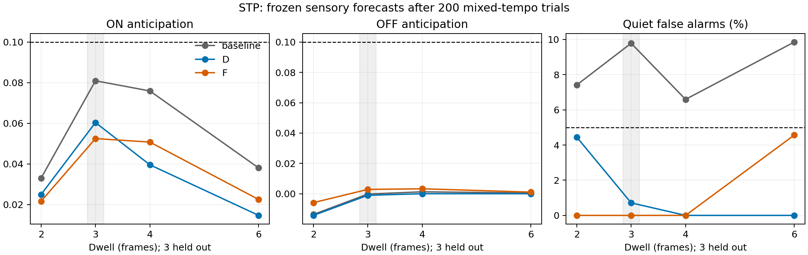

# Fixed short-term synaptic learning: neither candidate qualifies

Both depression (D) and facilitation (F) fail the unchanged prediction criteria at every tested tempo after 200 training trials. Lower threshold false-alarm rates do not establish effective prediction learning. The bounded family stops here: no confirmation, unit-release ablation, longer training, or tuning was triggered. M1A remains unmet; M1B remains blocked.

## Protocol and verification

The user-approved [comparison amendment](../plans/2026-09-21-short-term-target-comparison-amendment.md) was applied without changing release dynamics, topology, signs, local learning, or the no-backprop requirement. Both candidates started from original weights and trained on the identical seed-9060 mixed schedule: 67/67/66 trajectories at dwells 2/4/6. Neural simulation remained eight ticks per frame with a +8-tick forecast target and area-matched 20 ms excitation / 5 ms inhibition.

Frozen initial/trained baseline, D and F each received 15 trials per dwell 2/3/4/6, seed 9081. Dwell 3 was held out from training. Scores use only the fixed L3 body 82450 sensory target. All 24 neural evaluations preserved identical injected/scored targets and frozen weights; independent internal-target reconstruction had maximum error zero after the initial delay-history boundary. Internal differences are descriptive, not cross-model learning scores. Zero and persistence controls are included in the machine-readable results.

Reusing all saved evaluation conditions successfully revalidated artifact, stimulus and weight hashes, target equality and reconstruction, then recomputed scores and selection without new neural simulations. Published results equal the resumed raw results; all published raw-artifact checksums were verified.

## Frozen results after training

Anticipation must reach at least 0.1 for each polarity; quiet false alarms must be at most 5%, alongside the unchanged error-reduction criteria. Every row below fails the complete criteria.

| Dwell (frames) | Model | MSE | ON anticipation | OFF anticipation | Quiet false alarms |
|---|---|---:|---:|---:|---:|
| 2 | baseline | 0.158598 | 0.033052 | -0.013631 | 7.415% |
| 2 | D | 0.159306 | 0.025009 | -0.014232 | 4.449% |
| 2 | F | 0.158298 | 0.021691 | -0.005835 | 0.000% |
| 3 | baseline | 0.128685 | 0.080943 | -0.000176 | 9.786% |
| 3 | D | 0.130526 | 0.060391 | -0.000986 | 0.712% |
| 3 | F | 0.131224 | 0.052513 | 0.002895 | 0.000% |
| 4 | baseline | 0.113902 | 0.075937 | 0.001304 | 6.595% |
| 4 | D | 0.117248 | 0.039611 | 0.000048 | 0.000% |
| 4 | F | 0.115628 | 0.050784 | 0.003291 | 0.000% |
| 6 | baseline | 0.095838 | 0.038063 | 0.000536 | 9.856% |
| 6 | D | 0.096684 | 0.014725 | 0.000061 | 0.000% |
| 6 | F | 0.096280 | 0.022550 | 0.001109 | 4.567% |



## Initial controls change the interpretation

At held-out dwell 3, facilitation already predicted the correct sign for all 45 ON and 45 OFF samples before training, with zero threshold false alarms. Training retained those signs, but OFF anticipation **fell from 0.006849 to 0.002895**, far below 0.1. ON anticipation rose from 0.040323 to 0.052513. Quiet RMS increased from 0.019990 to 0.026349 despite the unchanged zero threshold-alarm count. This is not evidence that training learned OFF polarity or temporal localization.

Facilitation MSE improved only about 0.60% over its own initial state and was 1.97% worse than trained baseline at the held-out tempo. Depression improved about 4.42% over its own initial state but was 1.43% worse than trained baseline; its OFF anticipation changed from +0.001638 to -0.000986. Neither meets the required 20% overall error reduction from its own initial state, and neither qualifies for confirmation.

The target's excitatory L2 input magnitude changed from 0.025 to 0.005522 (D) or 0.014316 (F); its inhibitory L1 input changed from 0.045 to 0.202910 (D) or 0.049296 (F). The saved local updates still show opposing event contributions: ON decreases the excitatory magnitude and increases the inhibitory magnitude, while OFF does the reverse. Quiet contributions have the opposite signs to ON here. Summed proposed updates are not final weight differences because bounds are applied. These observations explain the direction of competition, but do not prove that all possible local temporal representations must fail.

## Runtime, checks and scope

Each training run processed 11,158 frames / 89,264 neural ticks. D took 417.61 seconds and F 415.66 seconds, excluding loading/warmup and including compression. These were concurrent diagnostic jobs (with some test overlap), approximately 26.7/26.8 frames/s per job, not an exclusive optimized-runtime benchmark. Simulation uses unpaced virtual ticks, not waits for real-time events. Both runs retained finite states and bounded weights/release state.

Code review identified an unsafe cached-evaluation shortcut. It was fixed before evaluation with hash checks and repeated target/reconstruction validation, covered by regression tests. Full verification: **269 passed, 4 skipped**. The report generator executed successfully and its plot was visually inspected.

This result rejects the two fixed STP settings under this one 200-trial training seed and controlled motion task. It does not rule out all short-term plasticity, prove adaptation solves timing, or establish that an additional temporal state is necessary. Any next temporal-context mechanism requires a separate evidence-driven proposal; no further model change is included here.

## Artifacts and reproduction

- [Full metrics and controls](2026-09-21-short-term-learning-results.json)
- [Selection: no qualifiers](2026-09-21-short-term-learning-selection.json)
- [Training runtime, stability and hashes](2026-09-21-short-term-learning-training.json)
- [Amended preflight verification](2026-09-21-short-term-learning-amended-preflight.json)
- [Incoming weights and local update sums](2026-09-21-short-term-learning-weights.json)
- [Raw artifact checksums](2026-09-21-short-term-learning-artifacts.json)
- [Historical preflight findings](2026-09-21-short-term-findings.md)

Run from the repository with its data and saved baseline artifacts available:

```powershell
.venv/Scripts/python scripts/short_term_learning.py amend
.venv/Scripts/python scripts/short_term_learning.py train-D
.venv/Scripts/python scripts/short_term_learning.py train-F
.venv/Scripts/python scripts/short_term_learning.py evaluate
.venv/Scripts/python scripts/short_term_learning_report.py
.venv/Scripts/python -m pytest -q
```

Training refuses to overwrite existing artifacts. Evaluation resumes verified saved conditions. Raw arrays remain under `runs/short-term-v1`; compact results and plots are versioned in the repository.
