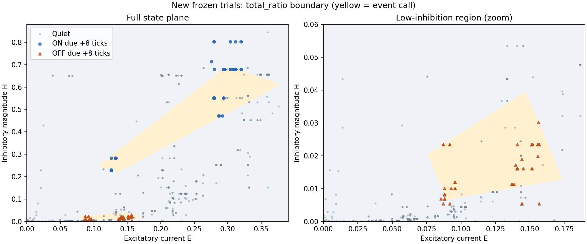

# A simple E/I boundary separates timing, but its margin is fragile

The state plane admits an interpretable boundary without another mini-model:
two windows combining total current and inhibitory fraction. On a newly
generated frozen evaluation batch it detects139/150 ON and139/150 OFF events
(92.67% each), with36/1869 quiet false positives (1.93%). Only3/600 nearby
quiet frames are called events. However, small perturbations substantially
reduce recall. This is a useful geometric explanation, not a robust gate yet.

No neural model, topology, signs, learning rule, weights, or dynamics changed.
All fits are offline diagnostics. M1A remains unmet.

## The boundary

Let E be the existing excitatory prediction current and H the positive
magnitude of existing inhibitory prediction current, measured at forecast issue
time. Define S=E+H and R=H/(E+H), with R=0 when both currents are zero.
Call an event due at+8ticks if either window holds:

| Region | Total current S | Inhibitory fraction R |
|---|---|---|
| ON-associated | 0.355347 to0.991355 | 0.617509 to0.698433 |
| OFF-associated | 0.096123 to0.186373 | 0.068777 to0.211973 |

Numbers above are rounded for explanation; exact inclusive bounds are in the
[results](2026-09-21-simple-ei-boundary-results.json). With small margins,
rounding these values can change classifications.

Division is not necessary: a ratio interval a<=R<=b is equivalent, for positive
total current, to a*S<=H<=b*S. The total-current lower bounds exclude zero.
Thus each region uses four linear comparisons of the two existing currents;
the full detector ORs two conjunctions. Equivalently, the ON region requires
approximately1.6144*E<=H<=2.3160*E, and the OFF region
0.073856*E<=H<=0.268992*E, together with the total-current windows.

The interpretation is specific: ON is inhibition-dominated within a bounded
amplitude range; OFF retains excitation with a small, nonzero inhibitory remnant.
An amplitude floor excludes quiescence; ratio and amplitude ceilings exclude
other parts of the current trajectory. This is not simply firing whenever
excitation wins, or whenever both currents are present.

Yellow indicates the selected offline event region. The right panel magnifies
the low-inhibition OFF region. Points are new seed9025 observations; repeated
states overlap heavily in the drawing. Shading outside observed states does not
establish biological behavior there.

## Selection and independent confirmation

The [protocol](2026-09-21-simple-ei-boundary-protocol.md) fixes nine simple
families and a bounded quantile-based search. Bounds come from seed9023
trials1-25; calibration uses26-35 with a5% quiet-error cap. Numeric choices
were saved before collecting50 new frozen trials (blank seed9025). Earlier
test and seed9024 data were already inspected, so those are retrospective
checks here, not new independent confirmation.

| Evaluation | ON detection | OFF detection | Quiet false positives |
|---|---:|---:|---:|
| Calibration10 trials | 27/30 (90.0%) | 27/30 (90.0%) | 10/362 (2.76%) |
| Prior test15 trials | 42/45 (93.3%) | 42/45 (93.3%) | 12/572 (2.10%) |
| Previously seen seed9024 | 139/150 (92.7%) | 136/150 (90.7%) | 39/1922 (2.03%) |
| New seed9025 | 139/150 (92.7%) | 139/150 (92.7%) | 36/1869 (1.93%) |
| Prior fixed neighbor probe, seed9025 | 145/150 (96.7%) | 149/150 (99.3%) | 79/1869 (4.23%) |

These detectors have different operating points; this does not establish
superiority of one across all thresholds. The simple detector sacrifices recall
for fewer quiet errors. Its fresh precision is88.54%. Each detected event uses
its corresponding ON/OFF-associated branch, with no opposite-branch event calls.
This association alone is not a test of a signed neural forecast after gating.

New quiet errors:1/150 immediately after ON,2/150 just before OFF,0/150 in each
of the two phases after OFF,33/1269 during blanks. Labels, phase, trial number
and future input never enter the boundary.

## What simpler expressions missed

The following are the minimum calibration quiet-error rates among the fixed
256 unions per family, regardless of recall. These are descriptive summaries
of the original candidate set, not further fitting on the new evaluation.

| Two-window/rectangle family | Lowest calibration quiet-error rate |
|---|---:|
| Excitation E | 30.94% |
| Inhibitory magnitude H | 17.40% |
| Total E+H | 25.97% |
| Difference H-E | 28.73% |
| Product E*H | 19.34% |
| Coincidence proxy min(E,H) | 11.33% |
| Inhibitory fraction alone | 5.25% |
| Separate E,H rectangles | 6.91% |
| Total plus fraction rectangles | 1.10% |

Only the last family supplied candidates under the5% calibration cap; its
selected candidate trades a little extra quiet error for more event recall.
These results apply to the tested quantile windows, not every possible threshold,
product, coincidence mechanism or boundary in those coordinates.

## The important weakness: small margins

Predeclared sensitivity checks on the unchanged selected boundary:

| Check | ON detection | OFF detection | Quiet false positives |
|---|---:|---:|---:|
| Original new observations | 92.7% | 92.7% | 1.93% |
| Independent current noise, SD1% of training current SD | 59.3% | 78.7% | 3.26% |
| Every bound expanded by1% of its training coordinate SD | 94.0% | 96.0% | 4.55% |
| Every bound contracted by1% of its training coordinate SD | 17.3% | 67.3% | 1.87% |

Noise is a numerical stress test, not a calibrated biological model. Expansion
is a sensitivity observation, not a newly selected candidate or a claim of
noise robustness; expanded bounds plus noisy currents were not tested.

A post-result margin audit explains the asymmetry:113/139 detected ON events
and38/139 detected OFF events sit within1% of a training-coordinate SD of at
least one edge. ON counts are82 near total-current bounds and31 near ratio
bounds. The median detected ON margin is only0.00000643 training SD. Quantile
bounds lie almost exactly on highly repeated event-state clusters. This is
threshold brittleness, not evidence that the underlying E/I representation has
lost its timing information.

## Recommended next step

Keep the two-current, two-region interpretation and investigate **margin**,
before a learned gate or new temporal cue. A bounded follow-up could select
slightly padded versions of these same linear windows using training/calibration
data and perturbations, then freeze them for another untouched evaluation batch.
The purpose would be to determine whether this geometry admits stable tolerances,
not to accumulate more disconnected rules or tune to seed9025.

Only after that should a mechanism be specified for expressing the existing
signed forecast. Eight offline fitted bounds do not explain how a neuron would
acquire the thresholds locally, nor prove biological plausibility. The experiment
also does not test other speeds/directions or arbitrary motion. No mechanism is
implemented or promoted by this result.

## Verification and artifacts

Reproduce with `.venv/Scripts/python scripts/simple_ei_boundary.py` using the
existing optional data extra and prior area-matched/local-information artifacts.
The script refuses to overwrite its run directory. New tests check current-sign
conversion, zero-current ratio, conjunction/union behavior, and quiet-error
accounting. Full suite:227 passed,4 skipped. Collection asserts frozen weights;
source checkpoint checksum and graph identity are checked. Production code is
unchanged.

[Results and sensitivity](2026-09-21-simple-ei-boundary-results.json),
[choices saved before new trials](2026-09-21-simple-ei-boundary-frozen-boundaries.json),
[calibration candidate summaries](2026-09-21-simple-ei-boundary-calibration-frontier.json),
[post-result margin audit](2026-09-21-simple-ei-boundary-margins.json).
Raw local states are in ignored `runs/simple-ei-boundary-v1/fresh.npz`; hashes
of that artifact, source training data and frozen choices are in the results.
