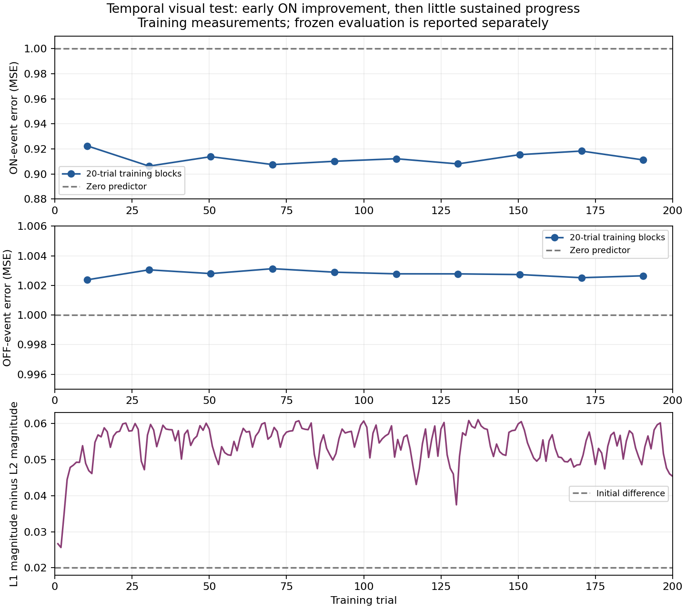

# Temporal motif: genuine but limited local learning

The unchanged local rule learns a small anticipatory ON improvement on this
controlled task. It does not pass the complete two-polarity capability gate.
This is a more informative result than the earlier silent or sign-incompatible
tests: frozen precursor traces pass the preflight, learned target-input weights
cause the improvement, and the improvement is not explained by becoming quiet.

## Task and execution

Anatomical inventory corrected the prior L2->L1 recommendation: all137 such edges
are excitatory. Among rendered targets, exactly one has both inhibitory and
excitatory directly injected same-column sources: L3 82450, receiving L1 26550
and L2 20655. This choice preceded simulation or learning-score inspection.
Retain all measured predictive inputs to the target and all their direct parents,
plus sensory cells at both dot positions:250neurons,1,664edges. Preserve weights,
signs, delays, point-neuron dynamics, retina and local learning exactly. There
are10,162incoming and12,896outgoing omitted boundary edges, so conclusions are
about this induced motif, not an intact fly circuit.

The dot alternates between neighboring columns at25ms dwell, with four50ms cycles
per trial and randomized12-36-frame blank gaps. The first cycle supplies the cue;
primary evaluation excludes those six frames while retaining all other quiet
frames. All-frame results including the cue are also saved. Forecast lead remains
8.33ms; the learner still optimizes its original one-neural-tick target.

The [protocol](2026-09-21-temporal-visual-protocol.md) fixes these choices and
thresholds. Frozen full/blank paired probes pass30/30 recurring ON events and
30/30 OFF events for sign-compatible, stimulus-dependent trace availability.
Actual currents reconstruct from recorded spikes and delays within1.33e-9.
Passing indicates available signals, not that the two polarities are separable.

Run200training trials(seed9022), then50fresh frozen evaluation trials(seed9023).
Those200trials contain800full cycles and1,600target ON/OFF events, across9,902
camera frames. Evaluation contains2,454frames. Preflight plus training and both
evaluations took132.33seconds. Two additional frozen weight-swap controls took
21.95seconds. Total neural execution154.28seconds, below600seconds. No extra
training, parameter sweep, backpropagation or model architecture changes.

## Frozen evaluation

| Predictor | Primary MSE | ON-event MSE | OFF-event MSE | Signed ON anticipation |
|---|---:|---:|---:|---:|
| Initial frozen | 0.13724768 | 0.96815878 | 1.00103104 | 0.01607073 |
| Trained | 0.13474748 | 0.92835957 | 1.00237179 | 0.03659279 |
| Zero | 0.13934046 | 1 | 1 | 0 |
| Persistence | 0.27868092 | 1 | 1 | 0 |

Primary scores contain2,153samples, including150ON and150OFF events. Trained MSE
is1.82% below frozen and3.30% below zero, short of the required20% improvement.
ON error improves; OFF remains worse than zero. Signed OFF anticipation is
-0.00118509, the wrong sign. Neither polarity reaches the0.1anticipation target.
The complete gate therefore fails, and M1A remains unmet.

Quiet-frame MSE **increases**, from0.00006250 to0.00027070; no quiet forecast
crosses the0.1false-alarm threshold. Thus this improvement is not quiet-period
suppression. Including the uncued first cycle also improves MSE, from0.16121286
to0.15902828; cue exclusion does not create the direction of the effect.

## Do the learned local weights cause the gain?

Frozen weight swaps use exactly the same50evaluation stimuli, fresh neural state
and ordinary warmup. Replace only the twelve measured predictive inputs to the
target; all other weights remain in their original initial/trained state.

| Frozen intervention | MSE | ON-event MSE |
|---|---:|---:|
| Initial network with learned target-input weights | 0.13475356 | 0.92844105 |
| Trained network with initial target-input weights | 0.13723563 | 0.96802145 |

The first intervention reproduces almost all the gain; the second removes almost
all of it. This supports attributing the gain to local target-input plasticity,
rather than a coincidental change elsewhere in the network. In particular,
L1 inhibitory magnitude increases0.045->0.060518 while L2 excitatory magnitude
decreases0.025->0.015175. No sign changes or new edges occur.

## Would more than200training trials make sense?

Not as the next major experiment. The saved training trace shows an early change
followed by fluctuations, without sustained later improvement:

| Training trials | ON-event MSE | OFF-event MSE | End-of-block L1 minus L2 magnitude |
|---|---:|---:|---:|
| 1-20 | 0.92246 | 1.00238 | 0.05759 |
| 21-40 | 0.90629 | 1.00305 | 0.05800 |
| 81-100 | 0.91015 | 1.00289 | 0.06068 |
| 181-200 | 0.91121 | 1.00265 | 0.04534 |

These are prequential training measurements, not periodic frozen evaluations;
network state/adaptation carries across trials, and blank intervals differ.
The effective target-input magnitude difference rises from0.020 to roughly
0.055-0.060 in the first20trials, then fluctuates without a persistent upward
trend. Final-trial phase affects the exact stopping weights. A longer run could
check stability or rare slower changes, but this trace supplies no positive
evidence that additional repetitions will fix OFF prediction.

Weights were reconstructed from the actual saved local eligibility and errors,
with original per-frame synchronization, bounds and homeostasis. Final weights
match the saved checkpoint-vector values within4.43e-7. The target's maximum
homeostatic rate estimate is17.0Hz, below the50Hz downscaling threshold, so that
mechanism did not cause the plateau at these incoming edges.

## Timing and signal representation remain distinct limitations

The learner optimizes a one-tick sensory increment, while the primary forecast
is eight ticks ahead. Separately, only L1 and L2 supply target-input spikes in the
trained evaluation; their responses are highly similar in time with opposite
fixed output signs. They are strongly active before recurring ON events and
weakly active before recurring OFF events. Having both signs therefore does not
automatically supply two independently useful temporal signals.

A strictly offline diagnostic checks these two issues without changing any
neural weights. With recorded trained spikes held fixed, solve bounded linear
least squares for the two existing active input magnitudes, with no intercept,
extra connection, backpropagation or deployed prediction head. Enumerate the
nine free/zero/maximum faces of the two-dimensional[0,10] box and solve free
coordinates by linear least squares. Fit trials2-25 and score26-50. Exclude the
first trial to remove unrecorded warmup history; reconstructed actual predictions
match within6.97e-9. The diagnostic optima stay below clipping, but this is NOT a
proof of globally optimal clipped forecasts or attainable coupled-network behavior.

| Offline fitting objective | L2 magnitude | L1 magnitude | Evaluation ON MSE | Evaluation OFF MSE | Quiet false alarms |
|---|---:|---:|---:|---:|---:|
| Original one-tick target | 0 | 0.05713 | 0.91061 | 1.00302 | 0% |
| Eight-tick task target | 0 | 0.33434 | 0.54594 | 1.01776 | 16.17% |

The first fit is consistent with the observed modest plateau. Optimizing the
longer horizon on these recorded features would strengthen ON predictions, but
still not repair OFF and would increase quiet false alarms above the5% gate.
Changing the horizon alone is therefore not supported as a sufficient fix by
this conditional analysis. It does not exclude changes in source activity under
different coupled weights, a different stimulus, or an approved model revision.

## Decision and reproduction

Stop here with a meaningful partial result: local plasticity can improve an
anticipatory visual signal in a real-spike, event-camera, measured-topology test.
The complete small-task gate and M1A still fail. The user-requested 1,000-trial
follow-up below checks whether the 200-trial result was simply undertrained.
The next design discussion should distinguish
the learning/evaluation horizon mismatch from the lack of ON/OFF-discriminating
prediction signals before choosing a bounded revision. Model changes still need
the user's approval; no new full-Pong run or M1B advancement is authorized here.

Run `.venv/Scripts/python scripts/temporal_visual.py --output runs/temporal-visual-v1`
with a fresh output directory. The initial source checkpoint checksum, induced
graph mapping and full configurations are in the
[results](2026-09-21-temporal-visual-results.json). The source checksum and all
frozen weight comparisons remain unchanged. Small traces are local, with hashes
in the [artifact index](2026-09-21-temporal-visual-artifacts.json).

Additional evidence: [weight swaps](2026-09-21-temporal-visual-weight-swap.json),
[learning curve](2026-09-21-temporal-visual-learning-curve.json),
[conditional feature analysis](2026-09-21-temporal-visual-feature-diagnosis.json).
The weight-swap operation is exactly `initial[incoming]=trained[incoming]` and
its reverse, followed by the same existing frozen evaluation runner. The learning
curve reconstructs each per-tick proposal as `eta*(target-previous_prediction)*e`,
sums each camera frame, applies existing bounds/homeostasis, and samples trial ends.

210 tests pass,4CUDA skips. Focused review found no timing, causal-control or
metric blockers. All checked raw neural states remain finite and weights bounded.

## User-requested 1,000-trial follow-up

Ran 1,000 total trials from the identical initial state, with the same seed,
stimulus, learning rule and model. The first 200 trials' weights, predictions,
targets, spikes and eligibility match the original run exactly. Evaluation uses
the same 50 frozen test trajectories. Source checkpoint remains unchanged.

| Frozen evaluation metric | 200 trials | 1,000 trials |
|---|---:|---:|
| Primary MSE | 0.134747 | 0.133457 |
| ON MSE | 0.928360 | 0.906754 |
| OFF MSE | 1.002372 | 1.003115 |
| ON signed anticipation | 0.036593 | 0.047948 |
| OFF signed anticipation | -0.001185 | -0.001556 |
| Quiet MSE | 0.000271 | 0.000460 |

Five times the training gives a further 0.96% reduction in overall MSE. ON
improves modestly, OFF remains wrong-sign and worsens, and quiet error increases.
This single-seed endpoint comparison does not prove convergence, but does not
support insufficient trial count as the sole explanation. The fixed learning
gate still fails; M1A remains unmet. No model changes were made.

Training took approximately 512.4 seconds; saving and frozen evaluation brought
the total to 524.46 seconds. The 48,905 training frames ran at 95.4 camera FPS
(407.54 seconds of simulated input at 120 FPS). Each trial contains multiple camera frames, each
with eight neural ticks. This diagnostic runner records spikes and selected
eligibility traces, checks neural state, and tallies updates each tick. Disk
compression occurs after training. No diagnostic overhead ablation was run, so
its fraction of runtime is unknown. This 250-neuron circuit is not directly
comparable to the earlier full-connectome throughput benchmark.

Reproduce with `scripts/temporal_visual.py --training-trials 1000 --output
runs/temporal-visual-1000-reproduction` using the project Python environment.
That command also repeats preflight and the frozen initial reference; this
follow-up reused those unchanged controls and verified its 200-trial prefix.
See [full results](2026-09-21-temporal-visual-1000-results.json) and
[local artifact hashes](2026-09-21-temporal-visual-1000-artifacts.json).
