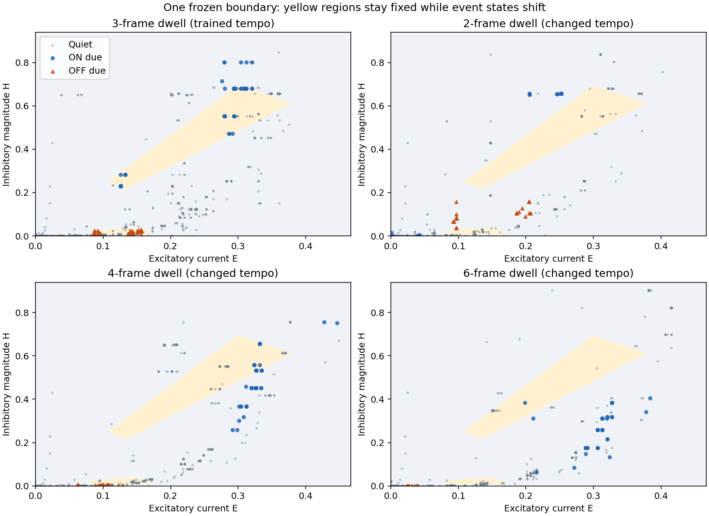

# The simple E/I regions do not transfer across motion tempos

The frozen boundary found at three-frame dwell fails at two-, four-, and
six-frame dwell. It is a separator for the trained periodic trajectory, not an
established general event-timing mechanism. This materially limits the earlier
positive local-information result: the existing currents encode useful timing
within that task, but the same current regions do not consistently mean
"event due next frame" when the motion period changes.

No threshold gate was added to neural execution. Learned area-matched weights,
connectome topology, signs, dynamics, local rule, eight ticks/frame and the
one-frame/+8tick forecast horizon remain fixed. M1A remains unmet.

## Frozen timing-transfer test, run first

Each new condition has25 trials,75 scored ON and75 scored OFF events. Random
blank intervals are matched across conditions using seed9026. Each trial still
contains four cycles, with its first complete cycle excluded and all remaining
quiet frames retained. Dwell changes transition spacing, not camera sampling
or forecast horizon. Motion remains periodic and therefore predictable; no
unannounced random timing jitter is introduced.

| Dwell | ON detection | OFF detection | Quiet false positives |
|---|---:|---:|---:|
| 3 frames, prior seed9025 reference | 139/150 (92.7%) | 139/150 (92.7%) | 36/1869 (1.93%) |
| 2 frames, frozen transfer | 0/75 | 0/75 | 69/789 (8.75%) |
| 4 frames, frozen transfer | 30/75 (40.0%) | 0/75 | 162/1089 (14.88%) |
| 6 frames, frozen transfer | 1/75 (1.3%) | 0/75 | 114/1389 (8.21%) |

The three-frame reference is from an earlier50-trial batch, not paired with the
new25-trial conditions. Different dwells change event density; denominators and
near-event errors are reported explicitly instead of relying on pooled accuracy.

At two-frame dwell,63/150 near-event quiet frames are false positives. At four
frames,147/450 are false positives, including70/75 on the last quiet frame
before ON. At six frames,93/750 are false positives;92 of these occur on the
second frame after ON/OFF. This is consistent with recognizing familiar
post-transition current states rather than a tempo-invariant due-event state.
It is an interpretation of the measured phase counts, not proof of one internal
causal mechanism.



The same yellow regions are drawn in every panel. New event states move outside
them, while quiet states enter them. The OFF region is near the bottom axis;
the prior simple-boundary figure provides a closer view of that region.

The prior current-only15-neighbor probe also fails to transfer, with ON/OFF
recalls13.3%/49.3%,0%/0%, and1.3%/0% at dwells2,4,6 respectively. Its quiet
false-positive rates are11.53%,16.44%,22.39%. Therefore this is not merely a
failure of the polygon simplification relative to the original diagnostic.
However, neither frozen probe is a test of whether another decoder could find
information at the new tempo. No new-tempo decoder was fitted.

The original signed neural forecast also changes with tempo:

| Dwell | ON correct sign | OFF correct sign | Mean signed ON / OFF anticipation |
|---|---:|---:|---:|
| 2 | 27/75 | 73/75 | 0.12934 /0.05316 |
| 4 | 73/75 | 75/75 | 0.17363 /0.08501 |
| 6 | 10/75 | 75/75 | -0.03935 /0.02637 |

Thus at six-frame dwell even ON polarity is unreliable, independent of any
gate. A nonnegative expression gate cannot turn a wrong-sign current into a
correct-sign prediction.

## Margin investigation, run afterwards

The requested margin investigation was completed after the frozen timing test.
It used only the original seed9023 training/calibration arrays to choose padding:
no changed-tempo samples were used in fitting. Each candidate expands both
rectangles symmetrically by a shared total-current and ratio padding. The fixed
25-candidate search includes clean calibration and five noisy calibration sets,
with1% training-current-SD independent Gaussian perturbations.

Calibration selects2% of training coordinate SD on each axis. Choices were saved
before collecting50 new original-tempo trials (seed9027). Five new perturbation
seeds9050-9054 evaluate sensitivity independently of calibration. These noise
checks are numerical perturbations, not a calibrated biological noise model.

| Boundary, original-tempo confirmation | ON detection | OFF detection | Quiet false positives |
|---|---:|---:|---:|
| Original, clean | 93.3% | 93.3% | 1.62% |
| Padded, clean | 94.0% | 96.7% | 5.08% |
| Original, five noisy sets (range) | 58.7-69.3% | 77.3-83.3% | 3.19-3.57% |
| Padded, five noisy sets (range) | 93.3-94.7% | 89.3-93.3% | 4.86-5.35% |

Padding substantially improves noise tolerance but admits more quiet samples.
It fails the predeclared robustness criterion: clean quiet errors slightly
exceed5%, some noisy sets also exceed5%, and some noisy OFF recall is below90%.
No further padding was selected after seeing these results.

Reusing the same original-tempo-selected padding at other tempos:

| Dwell | Padded ON detection | Padded OFF detection | Padded quiet false positives |
|---|---:|---:|---:|
| 2 frames | 0% | 0% | 10.90% |
| 4 frames | 46.7% | 0% | 16.90% |
| 6 frames | 1.3% | 0% | 10.87% |

The margin change does not repair tempo transfer. The unchanged0% OFF detection
at every new tempo is especially decisive against treating simple padding as a
general timing solution. Full phase counts for every condition are retained in
the [margin results](2026-09-21-timing-margin-results.json), and all calibration
candidates/conditions are in the [frozen selection](2026-09-21-timing-margin-frozen.json).

## Interpretation for the project

The earlier success should be described as **local information sufficient for
one trained tempo**, not general prediction learning. Encoding the offline
thresholds as a biological-looking gate would not remove that limitation.
Conversely, this frozen-transfer failure does not prove that the architecture
or local learning rule cannot generalize: the model was trained at only one
tempo, and no adaptation was allowed here.

Before proposing any gate, the next meaningful learning experiment should use
multiple predictable tempos, then assess separately (a) performance on trained
tempos with learning frozen, (b) transfer to a held-out tempo, and (c) adaptation
using only the existing local rule. Re-estimating supervised thresholds separately
for each tempo would not count as neural prediction learning. Timing may need
to depend on learned interval/history context; this experiment does not yet
establish whether that context is absent, unused, or learnable in existing state.
No new representation or architecture is approved or implemented by this finding.

Even successful tempo transfer on the same two positions would be a limited
step. Changes in path, position, direction, and appearance would still be needed
before describing the result as general visual prediction.

## Verification and reproduction

Run the stages in order with the existing data extra and prior artifacts:

```
.venv/Scripts/python scripts/timing_transfer.py transfer
.venv/Scripts/python scripts/timing_transfer.py margin
```

The transfer stage refuses to overwrite its output directory; margin choices
are also protected from overwrite. The collector adds an optional dwell argument
with default3. A default-dwell replay reproduces the original first trial's
features, labels, phases, full predictions and full network spikes exactly.
New tests check timing/event counts, first-cycle exclusions, unchanged +8tick
alignment, symmetric padding, input immutability and deterministic perturbations.
Full suite:232 passed,4 skipped. Collection asserts unchanged neural weights;
source checkpoint checksum and graph identity are checked at model load.

See the [protocol](2026-09-21-timing-transfer-protocol.md),
[frozen transfer choices](2026-09-21-timing-transfer-frozen.json), and
[transfer results](2026-09-21-timing-transfer-results.json).
Raw arrays live in ignored `runs/timing-transfer-v1`; result JSON includes their
checksums. No production neural code changed.
