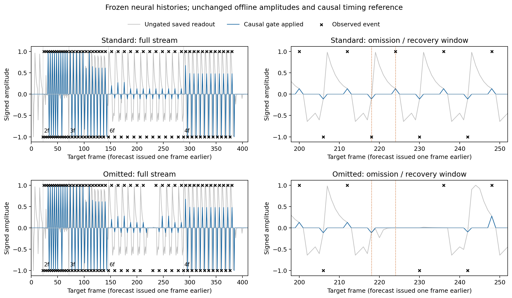

# The saved amplitude and causal timing rule transfer to continuous neural histories

The unchanged offline amplitude readout and causal selector work together on a
new uninterrupted neural trajectory with tempo changes and an unannounced
omission pair. No coefficients were refitted. Neural weights, signs, topology,
kinetics and plasticity remain unchanged. This is an expression-capacity result,
not evidence that the actual local learning rule acquires these coefficients.
M1A remains unmet and M1B blocked.

## Whole-stream results, including startup and recovery

| Condition | ON before / after gate | OFF before / after gate | Quiet alarms before / after | MSE before / after |
|---|---:|---:|---:|---:|
| Standard | .6549 / .6029 | .5834 / .5745 | 70.38% / 0.64% (2/314) | .3571 / .0832 |
| Omitted pair | .6636 / .6105 | .5967 / .5876 | 66.14% / 0.95% (3/316) | .3470 / .0795 |

Standard retains 92.1% ON and 98.5% OFF signed amplitude across the entire
stream. Both conditions satisfy the anticipation/quiet subset here, including
their initial missed events. The omitted stream's slightly better average MSE
is not evidence that omissions improve prediction: the target composition and
subsequent neural trajectory differ.



## Steady versus adaptation

Standard stream, excluding the first four scheduled events of each block and
the separately reported omission/recovery window at interval6:

| Interval (frames) | ON amplitude | OFF amplitude | Quiet alarms |
|---|---:|---:|---:|
| 2 | .5880 | .9986 | 0/21 |
| 3 | .9824 | .7715 | 1/43 |
| 6 | .1141 | .1478 | 0/78 |
| 4 | 1.0000 | .4801 | 0/57 |

Every steady event retains its full ungated amplitude. The interval-6 response
is substantially weaker and only narrowly above the .1 anticipation reference.
This is a real amplitude limitation, not attenuation by the timing selector.
Only the same three incoming eligibility columns (0,1,11) are active.

The gate misses the first four startup events and the first event after each
tempo switch, matching the sensory-only diagnostic. For interval6's adaptation
partition, ON anticipation is only .0478. Whole-stream means must not hide this.

Partition boundaries use scheduled target-event times. The quiet alarm at
frame143 is an old-tempo forecast during the switch to interval6, before its
first event at146; it therefore appears in the interval3 steady row above.
The other standard alarm is at384, the expected next event after motion stopped
at380. Both are expected continuation forecasts on an unannounced change.

## Omission and recovery expose an additional amplitude cost

Events at frames218 and224 are omitted. The first still elicits a forecast; the
second does not. All recorded neural spikes, eligibilities, local states and
forecasts match exactly before the first omitted observation, verifying that
no future omission leaked into the predictor.

The returning events at230 and236 are suppressed by the gate. Crucially, their
ungated signed amplitudes are already approximately 0.000000013 and .001985.
Removing the gate would not rescue those two predictions. This distinguishes
timing-reference recovery from the separate rebuilding of useful neural
predictive activity. By the third returning event, the gate is open again.
The remaining interval6 steady group has ON .1118 and OFF .1851 with no quiet
alarms. The final interval4 steady response returns to the standard values.

## What this supports next

We now have a concrete expression-capacity reference worth preserving:
polarity-conditioned amplitudes plus a causal local timing reference can work
on actual continuous histories, not just independently recorded fixed tempos.
Further fixed-threshold searches are not the priority.

The next bounded learning question is whether a causal online local update can
acquire the useful amplitudes when its eligibility and error refer to the same
issued, context-dependent expression. A diagnostic replay should compare the
existing scalar update with a split-context, gate-consistent update, holding
histories and the timing rule fixed; evaluate learning improvement from initial
weights, quiet conflicts, unseen tempo and omission recovery. Keep the saved
offline optimum as an upper reference, never as initialization or a success
claim for local learning. Any event balancing must use causal local counts,
not future class frequencies or test labels.

That update changes the experimental learning rule and should be specified in
an architecture proposal before implementation. The proposal must address both
expression and credit, additional local synaptic degrees of freedom, and what
happens when a closed gate receives an unexpected event. Simply multiplying
eligibility by a closed gate gives that missed event zero amplitude-learning
credit; ignoring the gate in credit recreates the expression/objective mismatch.
These are design choices requiring approval, not implementation details to hide.

## Checks, limits and reproduction

The new collector exactly reproduces the existing collector on a two-trial
control: incoming eligibility features, sensory state, targets, forecasts and
all spikes. Complete sensory reconstruction is exact on both new streams.
Source checksums, edge order and sign consistency are verified; final neural
magnitudes equal their initial frozen values. The relevant suite passed 55
tests. The completed experiment took about62 seconds including loading and
control runs; it did not train a network.

This is one deterministic sequence order and one omission placement on a small
two-position motif. It does not establish broad motion generalization,
biological plausibility of the reference mechanism, or robust online learning.
No changes were made to production model code.

```powershell
.venv/Scripts/python scripts/continuous_timing.py
.venv/Scripts/python scripts/continuous_timing_report.py
```

The run creates a new `runs/continuous-timing-v1` directory and deliberately
refuses to overwrite it. Complete arrays are retained there. A rerun requires
preserving/moving the existing directory first.

- [Predeclared protocol](2026-09-22-continuous-timing-protocol.md)
- [Exact scores, event records and artifact hashes](2026-09-22-continuous-timing-results.json)
- [Preceding causal sensory replay](2026-09-22-causal-timing-findings.md)
